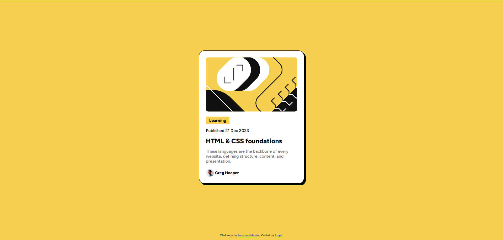

# Steph - Blog preview card solution

This is a solution to the [Blog preview card challenge on Frontend Mentor](https://www.frontendmentor.io/challenges/blog-preview-card-ckPaj01IcS). 

## Overview

### Screenshot

### Links

- Solution URL: [here](https://www.frontendmentor.io/solutions/solution-blog-preview-card-_4RUy9z-XM)
- Live Site URL: [here](https://xstephx.github.io/blog-preview-card-challenge/)

## My process

### Built with

- Semantic HTML5 markup
- CSS custom properties
- CSS Variables
- CSS Flexbox
- CSS Media Queries

# 🚀🚀🚀

